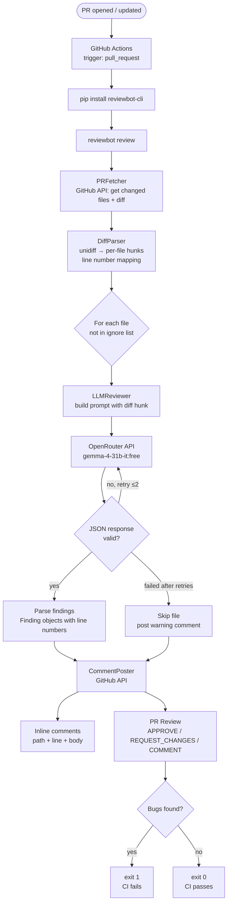
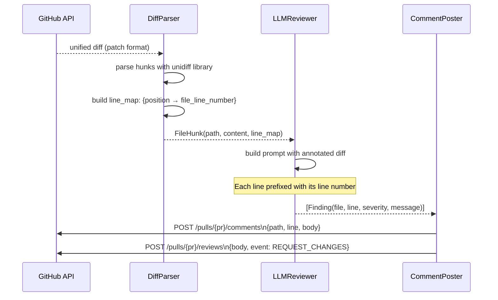
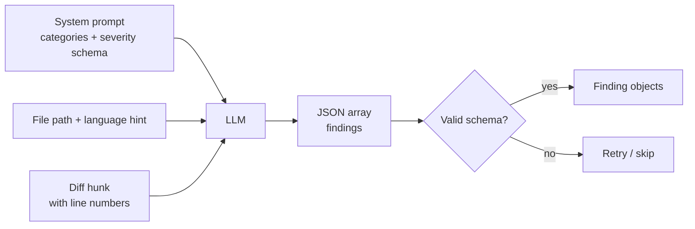

# ReviewBot
### Automated PR code review via GitHub Actions — free LLM, inline comments, zero setup beyond one secret.

---

## Why Build This

Every engineering team needs code review. ReviewBot is the kind of project that gets you hired because it's immediately deployable and solves a real problem interviewers understand. When you demo this in an interview, you're not showing a toy — you're showing something they could use on Monday.

**What you'll learn:**
- GitHub Actions — the most common CI/CD platform; knowing it deeply is a hiring signal
- GitHub REST API — fetching diffs, posting inline review comments, submitting PR reviews
- Unified diff format — parsing patch files to map LLM findings back to exact line numbers
- Structured LLM output — prompting reliably for JSON, handling malformed responses, retrying

**Why it stands out on a resume:**
Tools like CodeRabbit and GitHub Copilot PR Review cost $10–$20/seat/month. You've built the open-source equivalent. That's the story. The fact that it uses a free model (Gemma via OpenRouter) makes the cost argument even sharper.

**Standalone value:**
Two steps to add ReviewBot to any GitHub repo:
1. Copy `.github/workflows/reviewbot.yml` into the repo
2. Add `OPENROUTER_API_KEY` to GitHub Secrets

That's it. Works on any repo, any language, any team size.

---

## Problem

Code review bottlenecks ship bugs. The pattern is always the same: a PR sits unreviewed for hours, gets a rushed approval, and something obvious gets missed. Not because the reviewer is bad — because cognitive bandwidth is finite and review is expensive.

LLMs are good at catching the exact things reviewers miss when they're tired: NullPointerExceptions on the obvious path, bare `except` blocks, functions that got copy-pasted twice, SQL strings being built with f-strings.

| Tool | Cost/seat/month | Self-hostable | Free tier |
|---|---|---|---|
| GitHub Copilot PR Review | $19 | No | No |
| CodeRabbit Pro | $15 | No | Limited |
| ReviewBot | $0 | Yes | Full (free LLM) |

---

## What It Does

ReviewBot runs on every PR open and update. It fetches the diff, sends each changed file to an LLM, parses the response for specific line-level findings, and posts them as inline GitHub review comments with an overall summary.

**Inline comment example (on line 42 of `app/auth.py`):**
```
🔴 Bug — `user` could be None here if the query returns no rows.
Accessing `user.email` on line 43 will raise AttributeError.
Fix: add `if user is None: return None` before proceeding.
```

**PR summary comment:**
```
## ReviewBot Summary

Files reviewed: 4 | Findings: 6 (2 🔴 bugs · 3 🟡 warnings · 1 🔵 suggestion)

### 🔴 Bugs — fix before merge
- app/auth.py:42 — Possible NoneType on user.email
- app/routes/admin.py:87 — Missing ROLLBACK on exception path

### 🟡 Warnings
- app/services/query.py:23 — Bare except swallows all errors

### 🔵 Suggestions
- static/admin.js:134 — deleteDoc and deleteChunk share 80% logic

Powered by ReviewBot · google/gemma-4-31b-it:free
```

---

## Architecture

### GitHub Actions Flow



### Diff → Line Number Mapping



### LLM Prompt Design



---

## Tech Stack

| Library | Version | Role | Why this |
|---|---|---|---|
| `PyGithub` | 2.x | GitHub REST API (fetch diff, post comments, submit reviews) | Clean Python wrapper around GitHub API |
| `unidiff` | 0.7+ | Parse unified diff format → line number mapping | Purpose-built for diff parsing; handles edge cases |
| `httpx` | 0.27+ | OpenRouter API calls | Async, clean timeout handling |
| `pyyaml` + `pydantic` | latest | `reviewbot.yml` config parsing | Validate config at load time |
| `typer` | 0.x | CLI (`reviewbot review`) | Auto-generated `--help` |
| `pytest` + `pytest-mock` | latest | Tests with mocked GitHub API + LLM | No real API calls in CI |

**Distribution:** `pip install reviewbot-cli` — usable in any GitHub Actions runner without cloning the repo.

**Runtime:** Python 3.11+. No GPU, no Docker, no server.

---

## Configuration

```yaml
# reviewbot.yml  — place at repo root
model: google/gemma-4-31b-it:free    # any OpenRouter model

review:
  categories:
    - bugs          # NullPointerException, wrong conditions, logic errors
    - security      # SQL injection, hardcoded secrets, missing validation
    - error_handling  # bare except, swallowed errors
    - code_quality    # dead code, duplication
    # - performance   # uncomment to enable
    # - style         # uncomment to enable

  block_merge_on: [bug, security]    # these trigger REQUEST_CHANGES

  ignore:
    - "*.md"
    - "tests/**"
    - "migrations/**"

  max_files_per_pr: 20       # skip review on huge PRs
  max_lines_per_file: 400    # truncate large files
```

### GitHub Actions Workflow (copy into target repo)

```yaml
# .github/workflows/reviewbot.yml
name: ReviewBot
on:
  pull_request:
    types: [opened, synchronize, reopened]

jobs:
  review:
    runs-on: ubuntu-latest
    permissions:
      pull-requests: write
    steps:
      - uses: actions/checkout@v4
      - uses: actions/setup-python@v5
        with:
          python-version: '3.11'
      - run: pip install reviewbot-cli
      - run: reviewbot review
        env:
          GITHUB_TOKEN: ${{ secrets.GITHUB_TOKEN }}
          OPENROUTER_API_KEY: ${{ secrets.OPENROUTER_API_KEY }}
```

`GITHUB_TOKEN` is injected automatically — the only secret to add is `OPENROUTER_API_KEY`.

---

## Repo Structure

```
reviewbot/
├── reviewbot/
│   ├── cli.py              # typer CLI: review, test-connection
│   ├── runner.py           # ReviewRunner orchestration
│   ├── fetcher.py          # GitHub API: fetch PR diff + metadata
│   ├── parser.py           # unidiff → FileHunk + LineMap
│   ├── reviewer.py         # LLM prompt + JSON parse + Finding objects
│   ├── poster.py           # GitHub API: inline comments + PR review
│   ├── config.py           # reviewbot.yml → Pydantic models
│   └── models.py           # Finding, FileHunk, ReviewResult dataclasses
├── examples/
│   ├── reviewbot.yml
│   └── .github/workflows/reviewbot.yml    # copy-paste into target repo
├── tests/
│   ├── fixtures/
│   │   └── sample.diff     # real diff for parser tests
│   ├── test_parser.py
│   ├── test_reviewer.py    # mocked LLM
│   └── test_poster.py      # mocked GitHub API
├── PRD.md
├── README.md
├── pyproject.toml
└── .env.example
```

---

## Success Criteria

- Installs and runs on any GitHub repo in under 10 minutes from a cold start
- Posts inline comments with correct file path and line number (not just PR-level comments)
- Catches an intentional bug in a test PR (create one yourself to verify)
- Malformed LLM JSON → retries 2x, then skips file with a warning — workflow never fails due to LLM error
- Zero false `REQUEST_CHANGES` on PRs that only change markdown or test files

---

## Resume Bullets (fill in numbers after building)

- Built a GitHub Actions PR review bot that posts inline code comments at exact line numbers using a free OpenRouter LLM — installed with one secret and one workflow file
- Engineered a unified diff parser (using `unidiff`) that maps LLM findings back to specific file lines, enabling proper inline GitHub review comments rather than PR-level noise
- Packaged as `pip install reviewbot-cli` with graceful LLM failure handling: malformed JSON retries twice then skips — the workflow never fails due to model errors
- [Add: "Deployed on [N] repos, caught [X] real bugs in [Y] PRs" after using it]
