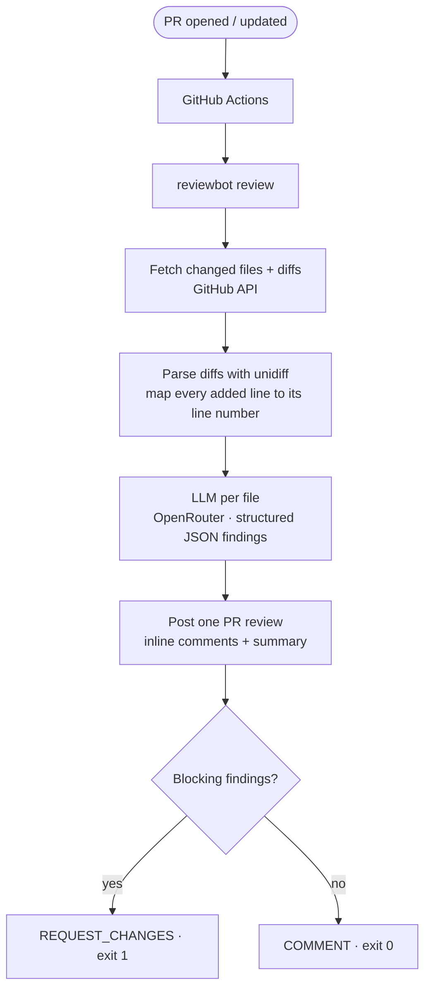

# 🤖 ReviewBot

[](https://github.com/swapnilsable-pro/reviewbot/actions/workflows/tests.yml)
[](https://www.python.org/downloads/)
[](LICENSE)

**Automated PR code review via GitHub Actions — free LLM, inline comments, zero setup beyond one secret.**

ReviewBot runs on every pull request, sends each changed file's diff to an LLM (default: `google/gemma-4-31b-it:free` via [OpenRouter](https://openrouter.ai) — completely free), and posts findings as **inline review comments at exact line numbers**, plus a summary. Bugs and security issues trigger `REQUEST_CHANGES` and fail CI.

| Tool | Cost/seat/month | Self-hostable | Free tier |
|---|---|---|---|
| GitHub Copilot PR Review | $19 | No | No |
| CodeRabbit Pro | $15 | No | Limited |
| **ReviewBot** | **$0** | **Yes** | **Full (free LLM)** |

## What it looks like

Inline comment on the exact offending line:

> 🔴 **Bug** — `user` could be None here if the query returns no rows. Accessing `user.email` on line 43 will raise AttributeError.
>
> **Fix:** add `if user is None: return None` before proceeding.

Plus a PR summary:

```
## ReviewBot Summary

Files reviewed: 4 | Findings: 6 (2 🔴 bugs · 3 🟡 warnings · 1 🔵 suggestions)

### 🔴 Bugs — fix before merge
- app/auth.py:42 — Possible NoneType on user.email
- app/routes/admin.py:87 — Missing ROLLBACK on exception path
...
```

## Install on any repo (2 steps, ~5 minutes)

> **Bring your own API key.** ReviewBot does **not** ship with a key and never calls anyone else's. Each repo that installs ReviewBot adds its **own** `OPENROUTER_API_KEY` secret, which stays encrypted in that repo. You are billed nothing on the free model.

**Step 1 — add the workflow file.**
Create `.github/workflows/reviewbot.yml` in your repo with this content (also in [`examples/workflows/reviewbot.yml`](examples/workflows/reviewbot.yml)):

```yaml
name: ReviewBot
on:
  pull_request:
    types: [opened, synchronize, reopened]

jobs:
  review:
    runs-on: ubuntu-latest
    permissions:
      pull-requests: write
      contents: read
    steps:
      - uses: actions/checkout@v4
      - uses: actions/setup-python@v5
        with:
          python-version: '3.11'
      - run: pip install git+https://github.com/swapnilsable-pro/reviewbot.git
      - run: reviewbot review
        env:
          GITHUB_TOKEN: ${{ secrets.GITHUB_TOKEN }}
          OPENROUTER_API_KEY: ${{ secrets.OPENROUTER_API_KEY }}
```

**Step 2 — add your OpenRouter key as a secret.**
1. Get a free key at **[openrouter.ai/keys](https://openrouter.ai/keys)** (the default Gemma model costs $0).
2. In your repo: **Settings → Secrets and variables → Actions → New repository secret**
3. Name: `OPENROUTER_API_KEY` · Value: your key · **Add secret**

That's it. `GITHUB_TOKEN` is injected automatically by Actions — `OPENROUTER_API_KEY` is the only secret you add. Open a pull request and ReviewBot reviews it within a minute.

**Optional — add a config file.** Drop a [`reviewbot.yml`](#configuration-optional) at your repo root to change the model, categories, ignore globs, or what blocks a merge. Without it, ReviewBot uses sensible defaults.

### Whose API key gets used?

Repository secrets are **scoped to a single repository**. The `OPENROUTER_API_KEY` you add to *your* repo is used only by ReviewBot runs in *your* repo — no one else can read or use it. Conversely, installing ReviewBot never makes you use the maintainer's key. And GitHub deliberately **does not expose secrets to workflows triggered by pull requests from forks**, so a random contributor opening a fork PR cannot consume your key either.

## Configuration (optional)

Drop a `reviewbot.yml` at your repo root — every key is optional, these are the defaults:

```yaml
model: google/gemma-4-31b-it:free    # any OpenRouter model id

review:
  categories:
    - bugs            # logic errors, None derefs, wrong conditions
    - security        # SQL injection, hardcoded secrets, missing validation
    - error_handling  # bare except, swallowed errors
    - code_quality    # dead code, duplication
    # - performance
    # - style

  block_merge_on: [bug, security]   # what triggers REQUEST_CHANGES + CI failure

  ignore:
    - "*.md"
    - "tests/**"
    - "migrations/**"

  max_files_per_pr: 20
  max_lines_per_file: 400

  verify: true           # second LLM pass that drops ungrounded findings (default: true)
  min_confidence: 0.7    # drop findings below this confidence score (default: 0.7)
  require_evidence: true # drop findings whose quoted line isn't in the diff (default: true)
```

`block_merge_on` matches **severities** (`bug`, `warning`, `suggestion`) and **categories** (`security`, …). PRs that only touch ignored files (docs, tests) are never blocked — ReviewBot exits 0 without calling the LLM.

ReviewBot now requires each finding to quote a proving line from the diff and clear a confidence threshold, so low-signal comments that older versions posted are suppressed. Tune the bar with `min_confidence` and `require_evidence`.

Add a `.github/reviewbot.md` file to your repo to inject project-specific review rules (style guides, security invariants, domain constraints) directly into the LLM prompt.

## How it works



The part that makes inline comments work: the diff parser annotates every added/context line with its line number in the new file before the LLM sees it, so findings cite real line numbers, which are validated against the diff and posted with `line` + `side: RIGHT` to the GitHub review API.

**Reliability rules**

- Malformed LLM JSON → retried twice with a corrective prompt, then the file is skipped with a note in the summary. **The workflow never fails because of an LLM error.**
- OpenRouter rate limits (free tier) → exponential backoff.
- `REQUEST_CHANGES` rejected (e.g. reviewing your own PR) → automatically falls back to `COMMENT`.
- Findings on lines outside the diff → listed in the summary instead of dropped.

## Run locally

```bash
pip install git+https://github.com/swapnilsable-pro/reviewbot.git

export OPENROUTER_API_KEY=sk-or-v1-...
export GITHUB_TOKEN=ghp_...          # needs pull-requests: write

reviewbot test-connection            # verify the key + model work
reviewbot review --repo owner/name --pr 123 --dry-run   # print findings, post nothing
reviewbot review --repo owner/name --pr 123             # post the review
reviewbot review --repo owner/name --pr 123 --no-verify # skip the second verification pass
```

Exit codes: `0` clean / non-blocking, `1` blocking findings (fails CI), `2` usage or config error.

## Limitations

- **PRs from forks:** GitHub gives fork PRs a read-only `GITHUB_TOKEN`, so ReviewBot can't post comments there (findings still appear in the Action logs). Same-repo branches work fully.
- The free Gemma model has rate limits; very large PRs review more slowly. Set `max_files_per_pr` accordingly or point `model:` at any paid OpenRouter model.
- An LLM reviewer catches the things tired humans miss — it does not replace human review.

## Development

```bash
git clone https://github.com/swapnilsable-pro/reviewbot.git && cd reviewbot
python3.11 -m venv .venv && source .venv/bin/activate
pip install -e ".[dev]"
pytest tests/ -v        # everything mocked — no API keys needed
```

Repo layout: `fetcher.py` (GitHub API) → `parser.py` (unidiff → line maps) → `reviewer.py` (OpenRouter + JSON parsing) → `poster.py` (inline comments + review) orchestrated by `runner.py`; `cli.py` is a thin typer wrapper.

## License

[MIT](LICENSE)
